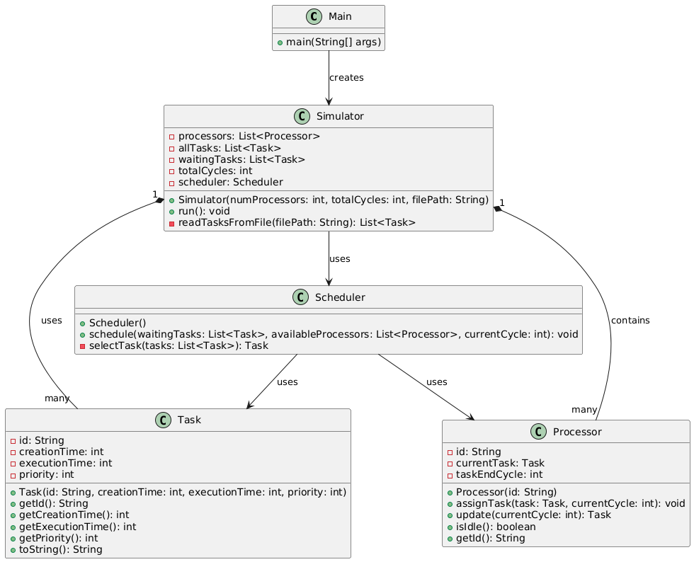
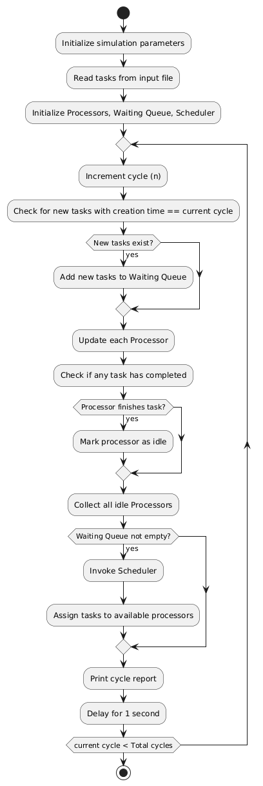

# Processor Execution Simulator

[Video]()


## Overview
The Processor Execution Simulator is a Java-based application that simulates the execution of tasks across a fixed number of processors in a synchronized environment. The simulation is cycle-based, where tasks are created, queued, scheduled, and executed over a defined number of clock cycles.

## Software Design and Architecture

### Key Classes



- **Main**
    - **Responsibility:** Acts as the entry point of the application. It hard-codes simulation parameters (number of processors, total cycles, and the task file location) and initiates the simulation by creating a `Simulator` instance.

- **Simulator**
    - **Responsibility:** Coordinates the simulation cycle. It reads tasks from the input file, maintains the simulation loop, and manages task creation, processor updates, and scheduling.
    - **Key Functions:**
        - **Input Parsing:** Reads a task file where the first line indicates the number of tasks, followed by lines with each task's creation time, execution time, and priority.
        - **Simulation Loop:** For each cycle:
            - Adds tasks to a waiting queue when their creation time is reached.
            - Updates processors to check for task completions.
            - Delegates scheduling to the `Scheduler` class.

- **Task**
    - **Responsibility:** Represents a task with an ID, creation time, execution time, and priority.
    - **Design:** Provides getters for task attributes and a `toString()` method for easy debugging.

- **Processor**
    - **Responsibility:** Models a processor that can execute one task at a time.
    - **Key Features:**
        - Tracks the currently assigned task and its completion cycle.
        - Provides methods to assign tasks and update its state (marking tasks as completed).

- **Scheduler**
    - **Responsibility:** Implements the task scheduling algorithm.
    - **Algorithm Details:**
        - **Priority Rule:** High-priority tasks (priority = 1) are always scheduled before low-priority tasks (priority = 0).
        - **Tie-Breaking:** If multiple tasks have the same priority, the task with the longest execution time is selected. In case of a tie, one task is chosen at random.
        - **Direct Assignment:** Instead of using an intermediary assignment class, the scheduler directly assigns tasks to available processors.

## High-Level Algorithm Explanation



1. **Input Parsing:**  
   The simulator reads a task file where:
    - The first line indicates the number of tasks.
    - Each subsequent line contains three integers: the task's creation time, execution time, and priority.

2. **Cycle-Based Simulation:**
    - **Task Creation:** At the beginning of each cycle, tasks scheduled for that cycle are added to a waiting queue.
    - **Processor Update:** Each processor checks whether its current task has finished execution. If so, it becomes available.
    - **Scheduling:** The scheduler is invoked to assign tasks from the waiting queue to available processors based on the priority rules.
    - **Real-Time Simulation:** A one-second delay (`Thread.sleep(1000)`) simulates real clock cycles.

3. **Task Scheduling:**
    - The scheduler filters tasks by priority.
    - From the filtered list, it selects the task with the longest execution time.
    - Random selection resolves ties, ensuring fairness.
    - Tasks are immediately assigned to idle processors.

## How to Run the Simulator

1. **Set Up the Project:**
    - Import the project into IntelliJ IDEA.
    - Ensure that all Java source files (e.g., `Main.java`, `Simulator.java`, `Task.java`, `Processor.java`, and `Scheduler.java`) are in the same package or directory.

2. **Hard-Code the File Location:**
    - In `Main.java`, update the `filePath` variable to point to your input task file. For example:
      ```java
      String filePath = "C:\\path\\to\\your\\tasks.txt";
      ```

3. **Compile and Run:**
    - Build the project using IntelliJ’s build tools.
    - Run the `Main` class. The console will display a cycle-by-cycle simulation report.


